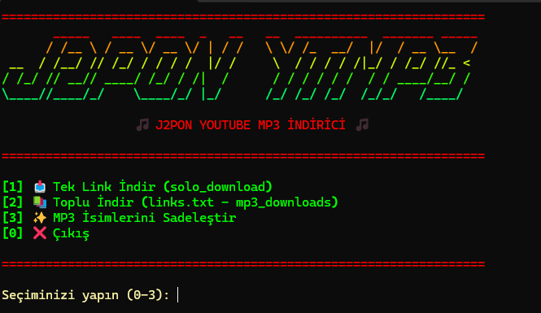

# 🎵 J2PON YTMP3 - YouTube MP3 İndirici

<div align="center">


**Terminal tabanlı, renkli ve kullanıcı dostu YouTube MP3 indirici**

[Özellikler](#-özellikler) • [Kurulum](#-kurulum) • [Kullanım](#-kullanım) • [Ekran Görüntüleri](#-ekran-görüntüleri)

</div>

---

## 📋 Hakkında

J2PON YTMP3, YouTube videolarını MP3 formatına dönüştürmek için geliştirilmiş terminal tabanlı bir Python uygulamasıdır. Renkli gradient menü, otomatik retry mekanizması ve akıllı dosya yönetimi ile kullanıcı dostu bir deneyim sunar.

## ✨ Özellikler

- 🎨 **Renkli Gradient Menü**: PyFiglet ve gradient-figlet ile oluşturulmuş görsel menü
- 📥 **Tek Link İndirme**: Tek bir YouTube linkini hızlıca indirin
- 📚 **Toplu İndirme**: `links.txt` dosyasından birden fazla linki otomatik indirin
- 🔄 **Otomatik Retry**: 403 hatalarında otomatik olarak tekrar dener
- 🚫 **Tekrar Kontrolü**: Zaten indirilmiş şarkıları atlar
- ✨ **İsim Sadeleştirme**: MP3 dosya isimlerini temizler (sadece `-` kullanır)
- 🎯 **Playlist Desteği**: Playlist linklerinden sadece tek videoyu indirir
- ⚡ **Hızlı ve Güvenilir**: yt-dlp ile optimize edilmiş indirme

## 🛠️ Kurulum

### Gereksinimler

- Python 3.7 veya üzeri
- FFmpeg (MP3 dönüştürme için)

### Adım 1: FFmpeg Kurulumu

**Windows:**
```bash
winget install ffmpeg
```

Veya [FFmpeg'i manuel olarak indirin](https://www.gyan.dev/ffmpeg/builds/) ve PATH'e ekleyin.

**Linux:**
```bash
sudo apt-get install ffmpeg
```

**macOS:**
```bash
brew install ffmpeg
```

### Adım 2: Python Paketlerini Yükleyin

```bash
pip install -r requirements.txt
```

### Adım 3: Kullanıma Hazır! 🎉

```bash
python yt.py
```

## 📖 Kullanım

### Menü Seçenekleri

Programı çalıştırdığınızda renkli bir menü görünecektir:

```
[1] 📥 Tek Link İndir (solo_download)
[2] 📚 Toplu İndir (links.txt - mp3_downloads)
[3] ✨ MP3 İsimlerini Sadeleştir
[0] ❌ Çıkış
```

### Tek Link İndirme

1. Menüden `[1]` seçeneğini seçin
2. YouTube linkini girin (örnek: `https://youtu.be/dQw4w9WgXcQ`)
3. Şarkı `solo_download` klasörüne indirilecektir

### Toplu İndirme

1. `links.txt` dosyasına YouTube linklerinizi yazın (her satıra bir link)
2. Menüden `[2]` seçeneğini seçin
3. Tüm şarkılar `mp3_downloads` klasörüne indirilecektir

**Örnek links.txt:**
```
https://youtu.be/dQw4w9WgXcQ
https://www.youtube.com/watch?v=9bZkp7q19f0
https://youtu.be/kJQP7kiw5Fk?list=PL...
```

### MP3 İsimlerini Sadeleştirme

1. Menüden `[3]` seçeneğini seçin
2. `mp3_downloads` klasöründeki tüm MP3 dosyalarının isimleri temizlenir
3. Özel karakterler kaldırılır, sadece `-` kullanılır

**Örnek:**
- Önce: `Şarkı Adı (Official Video) [2024].mp3`
- Sonra: `Sarki-Adi-Official-Video-2024.mp3`

## 📁 Klasör Yapısı

```
mp3/
├── yt.py                 # Ana program
├── links.txt             # Toplu indirme için linkler
├── requirements.txt      # Python bağımlılıkları
├── solo_download/        # Tek link indirmeleri
└── mp3_downloads/       # Toplu indirmeler
```

## 🎨 Ekran Görüntüleri

### Menü Görünümü

<div align="center">



*Renkli gradient menü ve ASCII art başlık*

</div>

**Terminal Çıktısı:**
```
============================================================
     🎵 J2PON YTMP3
     🎵 J2PON YOUTUBE MP3 İNDİRİCİ 🎵
============================================================

[1] 📥 Tek Link İndir (solo_download)
[2] 📚 Toplu İndir (links.txt - mp3_downloads)
[3] ✨ MP3 İsimlerini Sadeleştir
[0] ❌ Çıkış

============================================================
```

### İndirme Örneği

```
[1/78] ✓ Keskin & D-azy - KISA KELEŞ ll (Music Video)
  https://www.youtube.com/watch?v=6lWim4Uay2A

[2/78] ⊘ Zaten indirilmiş: LVBEL C5, AKDO - COOOK PARDON
  https://www.youtube.com/watch?v=wGAH8PSk-rg
```

## ⚙️ Özellik Detayları

### Otomatik Retry Mekanizması

- 403 hatası alındığında 5 saniye bekleyip tekrar dener
- Maksimum 3 deneme yapar
- Her denemede kullanıcıyı bilgilendirir

### Akıllı Dosya Yönetimi

- Zaten indirilmiş dosyaları tespit eder
- Tekrar indirme yapmaz
- Dosya isimlerini temizler ve düzenler

### Link Format Desteği

Desteklenen formatlar:
- `https://www.youtube.com/watch?v=VIDEO_ID`
- `https://youtu.be/VIDEO_ID`
- `https://youtube.com/embed/VIDEO_ID`
- Playlist linkleri (sadece tek video indirilir)

## 🐛 Sorun Giderme

### FFmpeg Hatası

**Hata:** `ERROR: Postprocessing: ffprobe and ffmpeg not found`

**Çözüm:**
1. FFmpeg'in kurulu olduğundan emin olun
2. PATH'e eklendiğini kontrol edin: `ffmpeg -version`
3. Windows'ta: `winget install ffmpeg`

### 403 Forbidden Hatası

Program otomatik olarak tekrar deneyecektir. Eğer sorun devam ederse:
- Birkaç dakika bekleyip tekrar deneyin
- VPN kullanmayı deneyin
- yt-dlp'yi güncelleyin: `pip install --upgrade yt-dlp`

### JavaScript Runtime Uyarısı

Bu uyarı normaldir ve işlevselliği etkilemez. Kaldırmak için:
```bash
pip install deno
```

## 📝 Lisans

Bu proje MIT lisansı altında lisanslanmıştır.

## 👨‍💻 Geliştirici

**J2PON**

- GitHub: [@j2pon](https://github.com/j2pon)
- Proje: YouTube MP3 İndirici

## 🙏 Teşekkürler

- [yt-dlp](https://github.com/yt-dlp/yt-dlp) - YouTube indirme kütüphanesi
- [pyfiglet](https://github.com/pwaller/pyfiglet) - ASCII art oluşturma
- [gradient-figlet](https://github.com/pwaller/gradient-figlet) - Gradient efektleri

## 📊 İstatistikler

- ✅ 80+ linki aynı anda işleyebilir
- ⚡ Otomatik retry mekanizması
- 🎨 Renkli ve kullanıcı dostu arayüz
- 🔄 Tekrar indirme kontrolü

## 🚀 Gelecek Özellikler

- [ ] Web arayüzü (Flask/FastAPI)
- [ ] Playlist tam indirme seçeneği
- [ ] Kalite seçimi (128kbps, 192kbps, 320kbps)
- [ ] Metadata düzenleme (ID3 tags)
- [ ] Çoklu format desteği (MP3, M4A, OGG)

---

<div align="center">

**⭐ Bu projeyi beğendiyseniz yıldız vermeyi unutmayın! ⭐**

Made with ❤️ by **J2PON**

</div>

